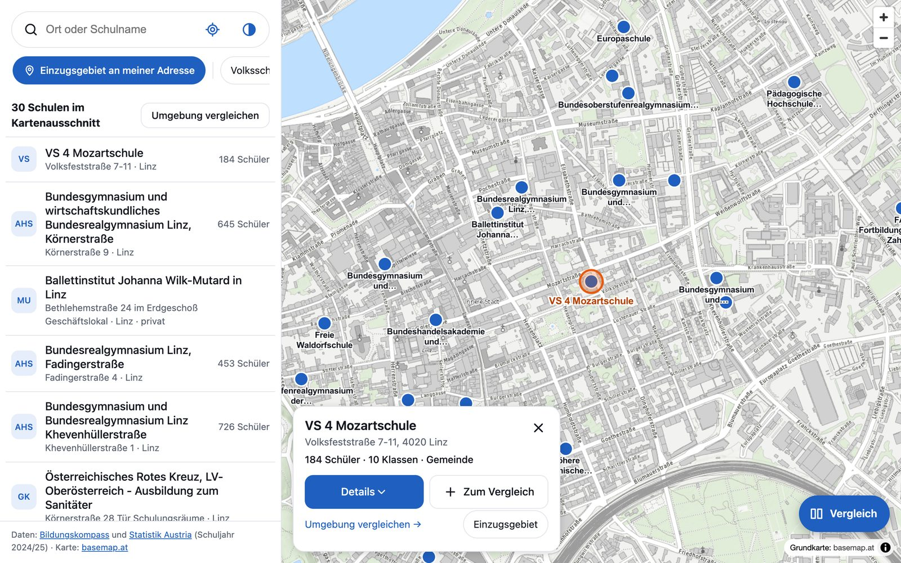
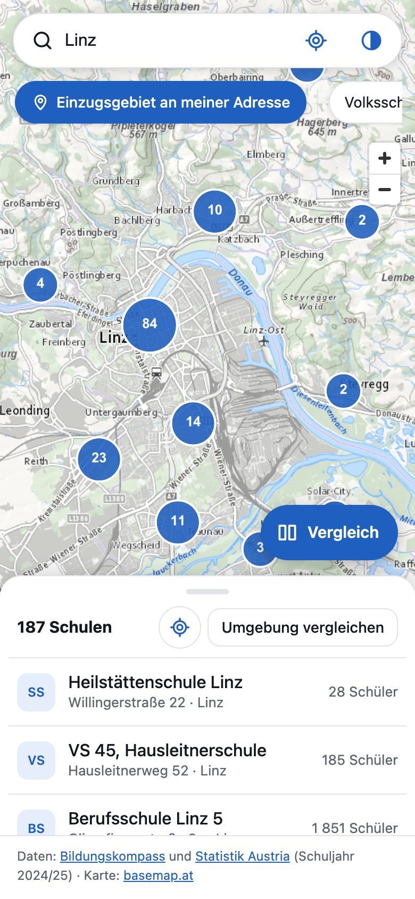
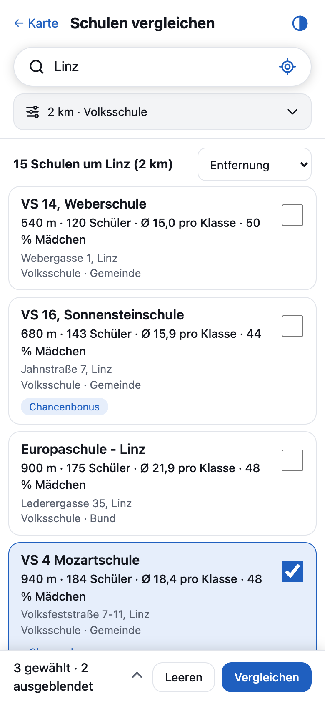
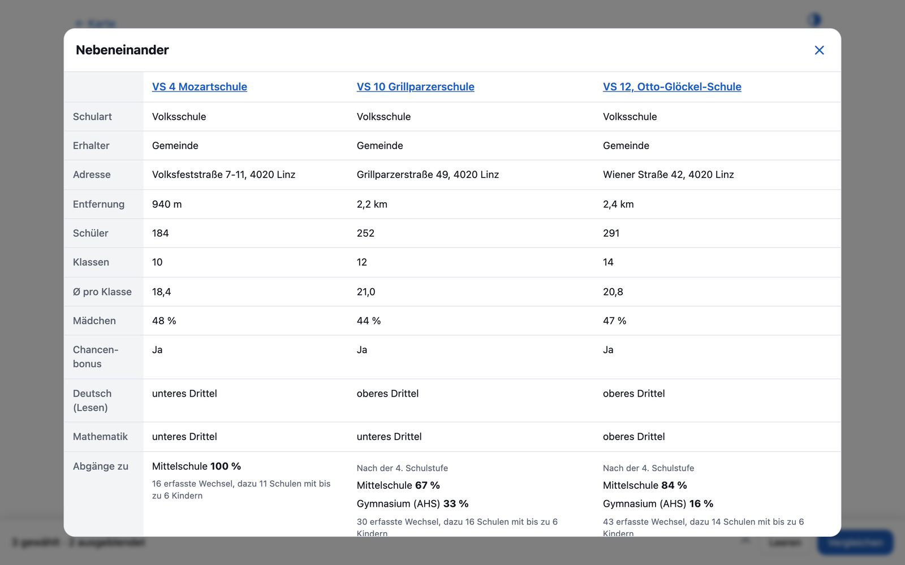
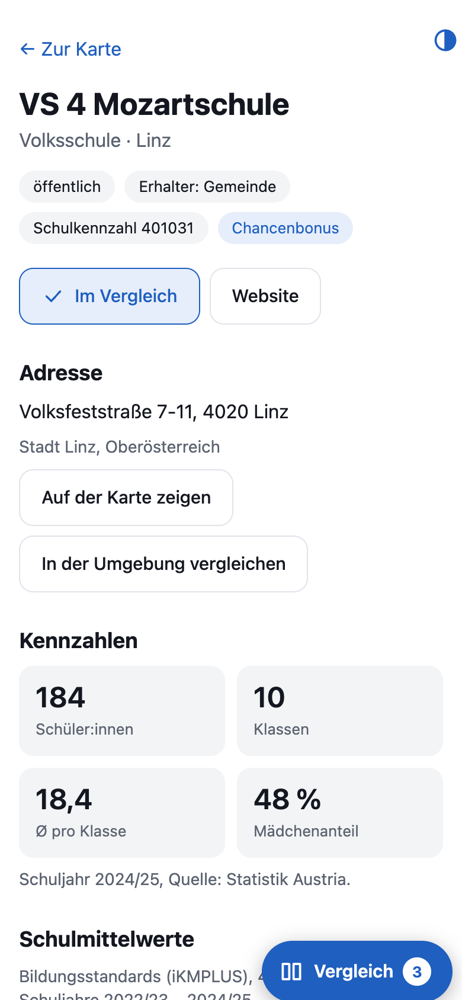

# SchulFinder – Schulen in Österreich finden und vergleichen

### [**Jetzt ausprobieren: entttom.github.io/SchulFinder**](https://entttom.github.io/SchulFinder/)

Kostenlos, ohne Anmeldung, ohne App. Funktioniert am Handy genauso wie am Computer.

[](https://entttom.github.io/SchulFinder/)

Du suchst eine Volksschule für dein Kind, eine Mittelschule oder ein Gymnasium in deiner Nähe? SchulFinder zeigt dir alle rund 6.000 Schulen in Österreich auf einer Karte und hilft dir, Schulen in deiner Umgebung nebeneinander zu vergleichen.

**[Zur Karte](https://entttom.github.io/SchulFinder/)**

---

## Was kannst du damit machen?

### Schulen auf der Karte finden

Gib einen Ort oder einen Schulnamen ein, oder tippe auf das Standort-Symbol, dann springt die Karte zu dir. Mit den Filtern oben grenzt du auf Volksschulen, Mittelschulen oder Gymnasien ein. Die Liste unter der Karte zeigt, was gerade im Kartenausschnitt liegt.



**Beispiel:** Suche nach „Linz“, tippe auf eine Schule in der Liste und du siehst Adresse, Schülerzahl, Klassenzahl und Schulerhalter.

[Jetzt auf der Karte suchen](https://entttom.github.io/SchulFinder/)

### Schulen in der Umgebung vergleichen

Tippe auf **„Umgebung vergleichen“** und du bekommst alle Schulen im gewählten Umkreis (zum Beispiel 2 km) als Liste, sortierbar nach Entfernung, Schülerzahl oder Klassengröße. Hake bis zu sechs Schulen an und sieh sie **nebeneinander** in einer Tabelle.



Der Vergleich zeigt zum Beispiel:

- Entfernung von deinem Standort
- Schüler:innen, Klassen und durchschnittliche Klassengröße
- Mädchenanteil
- Öffentlich oder privat, wer die Schule erhält
- Chancenbonus
- Wohin die Kinder nach der Volksschule wechseln



Den Vergleich kannst du **als Link teilen**, zum Beispiel mit deinem Partner oder anderen Eltern. Er ist dann genauso eingestellt wie bei dir.

**Probier es aus:** [Volksschulen im Umkreis von 2 km um Linz, drei davon nebeneinander](https://entttom.github.io/SchulFinder/vergleich/?lon=14.28580&lat=48.30690&o=Linz&r=2&k=vs&sel=401031,401061,401071&cmp=1)

### Eine Seite pro Schule

Zu jeder Schule gibt es eine eigene Seite mit Kontakt (Anrufen, E-Mail, Website, Route), Kennzahlen, Schulmittelwerten der Volksschulen und den Übertritten in weiterführende Schulen.



**Beispiel:** [VS 4 Mozartschule in Linz](https://entttom.github.io/SchulFinder/schule/401031/)

### Einzugsgebiet an deiner Adresse

Du willst wissen, an welchen Schulen in deiner Gegend wirklich Kinder aus deiner Nachbarschaft lernen? Gib deine Adresse ein, wähle die Schulart und SchulFinder zeigt dir, wie viele Kinder jeder Schule in deiner Wohngegend (einer 500-m-Zelle) wohnen.


[Einzugsgebiet an meiner Adresse prüfen](https://entttom.github.io/SchulFinder/einzugsgebiet/)

> Das ist **kein Schulsprengel** und kein Anspruch auf einen Platz. Es zeigt nur, aus welchen Gegenden die Kinder der Schule im aktuellen Schuljahr kommen. Zellen mit weniger als 3 Kindern werden zusammengefasst, damit niemand erkennbar wird.

---

## So kommst du schnell zum Ziel

| Ich möchte … | So geht's |
|---|---|
| Schulen bei mir in der Nähe sehen | [Karte öffnen](https://entttom.github.io/SchulFinder/) und auf das Standort-Symbol tippen |
| Schulen an einem anderen Ort ansehen | Ort in die Suche tippen |
| Nur eine Schulart sehen | Oben auf **Volksschule**, **Mittelschule** oder **Gymnasium (AHS)** tippen |
| Mehrere Schulen vergleichen | **Umgebung vergleichen** wählen, Schulen ankreuzen, **Vergleichen** tippen |
| Das Ergebnis teilen | Link in der Adresszeile kopieren, er enthält deine Auswahl |
| Dunkles Design nutzen | Auf das Halbmond-Symbol tippen |

## Gut zu wissen

- **Keine Anmeldung, keine Werbung, keine Statistik- oder Tracking-Dienste.** SchulFinder speichert nichts über dich, die Suche läuft in deinem Browser.
- **Adressen:** Wenn du eine ganze Adresse eintippst (zum Beispiel beim Einzugsgebiet), wird sie nur für die Ortssuche an [Nominatim (OpenStreetMap)](https://nominatim.openstreetmap.org) geschickt. Mit dem Standort-Knopf bleibt dein Standort auf deinem Gerät.
- **Schulmittelwerte** (Deutsch Lesen und Mathematik in der Volksschule) zeigt SchulFinder als Einordnung im Vergleich zu ähnlichen Schulen: oberes, mittleres oder unteres Drittel. Sie sind **kein Ranking** und sagen nur einen Ausschnitt über eine Schule. Eine Schule besichtigen und mit den Lehrkräften sprechen ersetzt das nicht.
- **Die Daten** werden einmal im Monat automatisch aktualisiert. Aktuell gilt das Schuljahr 2024/25. Es kann vorkommen, dass sich Kontaktdaten oder Zahlen inzwischen geändert haben. Bitte frag im Zweifel bei der Schule nach.

## Woher kommen die Daten?

| Quelle | liefert |
|---|---|
| [Bildungskompass](https://www.bildungskompass.gv.at) | Name, Schulart, Erhalter, Kontakt, Chancenbonus, Schulmittelwerte der Volksschulen |
| [Statistik Austria, Schulatlas](https://www.statistik.at/atlas/schulen/) | Standort, Klassen, Schüler, Übertritte, Einzugsgebiete |
| [basemap.at](https://basemap.at) | Grundkarte |

Jede Seite von SchulFinder nennt ihre Quellen. SchulFinder ist ein privates Projekt und nicht mit den Schulen, dem Bildungsministerium oder Statistik Austria verbunden.

## Fehler gefunden oder Idee?

Wenn dir etwas auffällt, zum Beispiel eine falsche Angabe oder ein Wunsch für eine neue Funktion, lege gern ein [Issue auf GitHub](https://github.com/entttom/SchulFinder/issues) an.

---

### [Jetzt SchulFinder öffnen](https://entttom.github.io/SchulFinder/)

---

<details>
<summary><b>Für Entwickler:innen</b></summary>

<br>

SchulFinder ist eine statisch gebaute Website ([Astro](https://astro.build), [MapLibre](https://maplibre.org)) ohne Backend. Die Schulkennzahl (SKZ) ist der gemeinsame Schlüssel der Datenquellen.

```bash
npm install
npm run data   # lädt und verknüpft die Quellen nach public/data/ (Übertritte beim ersten Mal ca. 8 Minuten)
npm run dev    # http://localhost:4321
npm test       # Tests der Zusammenführung
npm run build  # erzeugt dist/ (eine Seite pro Schule)
```

`npm run data -- --offline` führt die Daten nur aus `.cache/` neu zusammen, `-- --no-uebertritte` überspringt die Übertritte.

**Datenquellen im Detail**

- Die Bildungskompass-API ist nicht als offene Schnittstelle dokumentiert. Der Abruf erfolgt einmal pro Lauf, gedrosselt und mit eigenem User-Agent.
- Die Lizenz der Zusatzfelder des Schulatlas ist nicht ausdrücklich geklärt. Die offenen Stammdaten stehen als [OGD unter CC BY 4.0](https://data.statistik.gv.at/web/meta.jsp?dataset=OGDEXT_SCHULSRV_1).
- Die erzeugten Daten (`public/data/`, `.cache/`) liegen nicht im Repository. Sie entstehen im Build.

**Deployment**

GitHub Pages über `.github/workflows/deploy.yml` (bei Push auf `main`, monatlich und manuell). In den Repository-Einstellungen unter Pages die Quelle „GitHub Actions“ wählen. Für eine eigene Domain `BASE` im Workflow auf `/` setzen.

Die Screenshots in diesem README liegen in `docs/screenshots/`.

</details>
